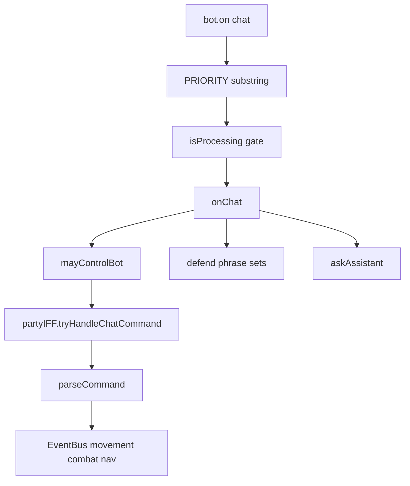

# Audit: player-facing commands & core mechanics

> Historical note (important): this document captures the pre-router audit snapshot that
> motivated Phases A-D. Current implementation is parser/registry/dispatch-based.
> For up-to-date behavior and product surface, see `docs/COMMAND_SYSTEM_CURRENT.md`.
>
> Status: **COMPLETED**. All planned phases (A-D) are finished; this file is retained as an audit artifact.

**Supplement (post–Phase D):** в продукт добавлена чат-команда **`attack_direct`** (прямая атака: `commands/commandRegistry.js` → `applyCombatPolicy` → `resolveAttackTarget` → `commands/handlers/combat.js` → `CombatEvents.ENGAGE_ENTITY`). Детали, фразы, политика FLEE/session/defend/override и коды результатов — в **`docs/COMMAND_SYSTEM_CURRENT.md` §7**; этот аудит остаётся снимком мотивации фаз A–D, без дублирования новой поверхности.

**Purpose:** machine-readable audit for another assistant / reviewer.  
**Scope:** chat routing, permissions, combat/nav locks, defend/follow/patrol, flee, party, inventory commands.  
**Sources (repo snapshot):** `events.js`, `systems/AIIntentSystem.js`, `systems/PartyIFFSystem.js`, `systems/FollowSystem.js`, `navigation/NavigationController.js`, `defend.js`, `systems/CombatSystem.js`, `core/BotBrain.js`, `attackEntity.js` / `combat/session/*`.

---

## 1. Architecture snapshot (historical)

### 1.1 Chat pipeline (historical)

1. `bot.on('chat')` → `PRIORITY_COMMANDS` substring match → if `isProcessing && !isPriority` → **silent return**.
2. Else `onChat(username, message)`:
   - `mayControlBot(username)` → party **OR** `config.allowedUsers` (empty list = everyone for allowlist branch).
   - `partyIFF.tryHandleChatCommand(username, raw)` for `party|friend add|remove|list|clear`.
   - `parseCommand(msg)` from `createAI` (`systems/AIIntentSystem.js`).
   - Movement set: `stopAttack` (silent) before `follow|guard|come|dump`.
   - Handlers: `come`, `follow`, `guard`, `stop`, `inv`, `dump`, `отмена защиты`, `craft_gear`, `статус пути`, defend phrases, then AI `askAssistant` + cooldown.

### 1.2 Execution surfaces

- **Bus:** `MovementEvents.SET_FOLLOW | SET_COME | SET_IDLE`, `CombatEvents.SET_GUARD`, `NavEvents.GOTO | STOP`, `CombatEvents.ENGAGE_ENTITY | STOP_ATTACK`, defend events via `BotBrain` / `DefendSystem`.
- **FollowSystem:** periodic `nav:goto` when `follow|guard` + `navFollowViaBus`, unless FLEE/COMBAT/`isCombatSessionActive()`.
- **NavigationController:** `nav:goto` / `nav:stop` → `pathfinder.setGoal` **blocked** if `isCombatSessionActive()`.
- **defend.js:** `pathfinderYieldedToCombat()` = `CoreStates.COMBAT | FLEE | fleeCooldown | isCombatSessionActive()`.
- **attackEntity / CombatSession:** owns `isCombatSessionActive` / try-enter slot / pathfinder during fight.

### 1.3 Two “combat” notions

| Signal | Meaning |
|--------|---------|
| `isCombatSessionActive()` | `attackEntity` / `CombatSession` registered or exclusive slot busy |
| `CoreStates` (BotBrain) | `IDLE`, `FOLLOWING`, `COMBAT`, `FLEE` — used by FollowSystem (COMBAT/FLEE) and defend yield |

They can diverge: e.g. Follow gates on FSM **and** `isCombatSessionActive`; defend uses **both** FSM and session.

---

## 2. Audit table

| Command / mechanic | Expected | Actual pipeline | Combat / lock | Known issues | Root cause | Recommended fix | Severity |
|---------------------|----------|-----------------|---------------|--------------|------------|-----------------|----------|
| **follow** | Sender = follow target; nav after combat | `parseCommand` → `stopAttack` → `SET_FOLLOW` / `setModeFollow` | `isCombatSessionActive()` blocks FollowSystem + NavController | RU aliases only exact strings in `parseCommand`; PRIORITY uses `includes` → false positives | Split parsers + substring priority | Single command router; shared priority detection | Medium |
| **come** | One-shot walk to sender | `SET_COME` / `setModeCome`; `goal_reached` → idle | Same as follow | `иди ко мне` uses `messageLower.includes` → long-message false positives | Mixed exact + substring | Tokenize / word-boundary | Medium |
| **stop / idle** | Idle + end combat session | `stopAttack` then `SET_IDLE` | Session cleared | `nav:stop` ignored while `isCombatSessionActive()` (by design) | Combat owns pathfinder | Document; optional owner `force` stop | Low |
| **guard** (compact) | Guard sender | `SET_GUARD` + bus nav | FollowSystem + session lock | `охраняй`/`защищай` single-word vs `… меня` defend — intentional | Two products in one UX | Document | Low |
| **defend me** | Long defend entity | `msg` in Set → `defend.defendEntity({ player_name: sender })` | defend waits `pathfinderYieldedToCombat` / combat end | No `stopAttack` before starting defend (unlike follow) | Handler order | Optional `stopAttack` before defend or explicit error | Medium |
| **defend player** (quoted) | Defend nick | Regex on `raw` → `defendEntity` | Same | Same | Same | Same | Medium |
| **defend point** | Anchor + optional patrol | `defendPoint({})` | Same | Patrol needs `defendPatrolEnabled` | Config | Document `PATROL_ENABLED` | Low |
| **Patrol (ring)** | Optional patrol | **Not** in `events.js` chat; AI tool `patrolMode` → intent → `DefendSystem` → `defend.patrolMode` | Gated by config + yield | No direct player chat command in events | By design | Add chat command or document “AI/intent only” | Low (expectation) |
| **Combat engage** | Start PvP | Bus `ENGAGE_ENTITY` / AI tool → intent | `tryEnterCombatExclusive` | Chat does not call engage directly; permissions at intent producer | Split surfaces | Centralize “who may engage” on intent path | High if intents untrusted |
| **Combat disengage** | Stop | `STOP_ATTACK` / chat `stop` | `stopAttack` | Two entry points OK | Duplication | Thin `stopCombat()` wrapper | Low |
| **FLEE / recovery** | Low HP flee, heal, re-engage / restore last mode | `CombatSystem._enterFlee`, `stopAttack`, nav ticks, `_tryConsumeHeal` | defend yields on FLEE | `waitUntilCombatEnds` listens `STATE_CHANGED` — session end may not emit it | Wrong coupling | Event on session end or poll `isCombatSessionActive` | Medium |
| **Party / friend** | List/add/remove/clear | **Chat:** after `mayControlBot`, `tryHandleChatCommand`. **Whisper:** `PartyIFF._onWhisper` → same handler with **`_isAllowedCommander`** only | — | **Whisper party = allowlist-only**; **public chat = party OR allowlist** | Two permission implementations | One `mayControlBot` (or shared helper) for both | High |
| **inv / dump** | Summary / drop junk | `parseCommand` → handlers; `dump` runs `stopAttack` first | Dump clears combat; inv does not | Static keep-list for dump | Heuristic | Registry/metadata optional | Low |
| **craft_gear / статус пути / отмена защиты** | Misc | `parseCommand` vs raw `msg` | Varies | Ad hoc strings; PRIORITY substring collisions | No router | Consolidate | Low |
| **AI fallback** | Chat → LLM | After handlers; `lastAiReplyAt` cooldown | Long `askAssistant` holds `isProcessing` | **Non-priority messages silently dropped** | Mutex + weak priority | Queue or log + better priority | High |

---

## 3. Cross-cutting weaknesses

1. **Three parsers:** `parseCommand` (AIIntentSystem), raw sets/regex in `events.js`, PartyIFF regex — no single source of truth.
2. **`PRIORITY_COMMANDS`:** `text.includes(cmd)` — substring false positives / “priority” without real parsing.
3. **`isProcessing` + silent return** — user perceives “bot ignores commands”.
4. **Permission duality:** `mayControlBot` vs PartyIFF `_isAllowedCommander` on whisper.
5. **Combat matrix:** `isCombatSessionActive` vs `CoreStates` — easy to misuse when extending.
6. **Defend wait:** `waitUntilCombatEnds` tied to `STATE_CHANGED`, not session lifecycle.

---

## 4. Remediation plan

### Phase A — Contract

- One-page matrix: trigger → permission → execution → cleanup.
- Document combat lock: who may `setGoal` / `nav:*`.
- Align whisper party gate with `mayControlBot` or document intentional difference.

### Phase B — Command router

- `commands/parsePlayerMessage` → `{ kind, payload } | null`, ordered: party prefix → movement → defend → inv/dump → craft → null.
- Replace PRIORITY substring with: priority if parser non-null **or** party prefix.
- **Never silent drop** for allowed users: log or short “busy” reply / queue.

### Phase C — Mechanics

- Emit **session-ended** (or bus) from combat dispose; fix `waitUntilCombatEnds`.
- Optional: `nav:stop` with `force` for owner after verified `stopAttack`.

### Phase D — i18n / product

- Single alias table; patrol chat if desired.

---

## 5. Recommended fix order

1. **High:** Silent chat drops (`isProcessing` + priority) — log, queue, or tighten detection.
2. **High:** Unify party / allowed permission (whisper vs chat).
3. **Medium:** `waitUntilCombatEnds` decouple from `STATE_CHANGED`.
4. **Medium:** Single command router; remove duplicate RU/EN logic.
5. **Medium:** Replace substring PRIORITY with structured detection.
6. **Low:** Document FSM vs `attackEntity` session, patrol entry points.
7. **Low:** Chat-exposed patrol or explicit “AI only” in docs.

---

## 6. File map (for navigators)

| Concern | Primary files |
|---------|----------------|
| Chat | `events.js` |
| `parseCommand` | `systems/AIIntentSystem.js` |
| Party | `systems/PartyIFFSystem.js` |
| Follow / bus nav | `systems/FollowSystem.js`, `navigation/NavigationController.js` |
| Defend / patrol | `defend.js`, `systems/DefendSystem.js` |
| Combat session | `attackEntity.js`, `combat/session/CombatSession.js`, `combat/session/sessionFlags.js` |
| FLEE / engage / stop | `systems/CombatSystem.js` |
| Intents | `core/BotBrain.js`, `core/IntentTypes.js`, `systems/AIIntentSystem.js` (tools) |
| Inv chat | `features/inventoryChatCommands.js` |

---

*End of audit document.*
